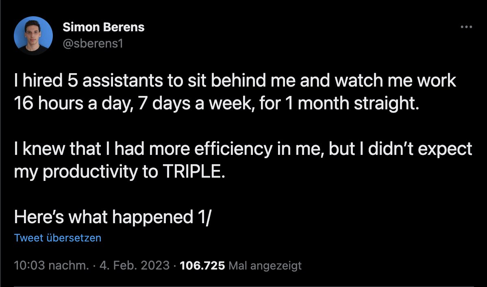

# Productivity
Ever noticed how much more efficient you are while someone is watching? #screenwatch is watching now.

[](https://twitter.com/sberens1/status/1621977693620432896)

## Install
```

pip install git+git://github.com/nielsrolf/screenwatch
```


## Commands
```
watchme config

watchme start <project> [<task>]
watchme stop

whatchme what # tells you what you're working on

watchme today project1/todo1 project1/todo2 # add a todo for today
watchme todo # tells you the todos that are overdue, due today and done early
```


## Todo
- CLIP analyze contents
- add webcam pictures
